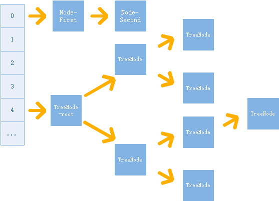

HashMap 学习笔记

#### 概览
* **数组+链表**：哈希冲突较小时，是单链表扩展存储；当同个哈希地址冲突到一定次数时，会进行数组扩容，或将对应的单链表树化为红黑树结构进行存储。
* **key和value均允许为null**
* **哈希冲突解决方式：链地址法+树化优化**，相同哈希地址的元素，组成单链表，将单链表的头结点存储在散列表第i个单元中。单链表个数超过一定限制时，将单链表树化成红黑树结构进行存储。



#### 读写机制
* **初始化**：默认初始化长度为0的数组，在添加第一个元素的时候，才会创建一个默认长度为16的数组。负载因子默认为0.75。数组长度及负载因子均可设置。触发重新hash的扩容阈值threshold为：
```散列表数组长度*负载因子```
* **添加元素**：定位到key对应的哈希地址的单链表，进行遍历；如果已存在相同key的Node元素，则覆盖原本的value值；如果不存在,（先做扩容判断及操作）则创建Node对象，作为对应单链表的尾结点。<br/>
    如果某个单链表的节点个数等于8，并且散列表数组长度小于64，则对散列表数组进行扩容。<br/>
    如果某个单链表的节点个数等于8，并且散列表数组长度大于等于64，则对当前这个单链表进行树化，转换为红黑树形式进行存储。
* **扩容条件公式**
```
    真实元素个数：count
    当前数组长度：len
    负载因子：loadFactor，默认0.75，可配
    
    场景一：当数组长度超过扩容阈值时，
        公式：count > len * loadFactor
    场景二：当某个哈希地址对应的单链表，结点个数等于8，并且len<64时，也会触发扩容（代码在树化函数treeifyBin()中）
```
* **扩容后新数组长度公式**
```
    新数组容量：newCapacity
    旧数组容量：oldCapacity
    
    公式：newCapacity = oldCapacity << 1
```
* **数组扩容策略**：追加一个新的Node元素之后，会判断是否需要对当前的hashtable进行扩容并重新hash。重新hash的触发条件是：**扩容条件公式**。新数组长度为原来的2倍（**扩容后新数组长度公式**），创建新数组后，会遍历旧数组的所有元素，拷贝、组建新数组的内容。
* **查找指定位置元素**：找到对应的哈希地址后，按照结点的类型是Node，还是TreeNode，进行单链表的查找或者红黑树结构的查找。
* **删除元素**：找到对应的节点后，按照单链表结构或者红黑树结构删除节点。