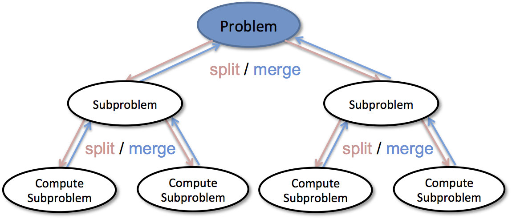

学习笔记

####递归、分治、回溯

##### 递归
- 找到最近最简方法，将其拆解成可重复解决的子问题，实现时关注于子问题的实现，拒绝人肉递归
- 数学归纳法

##### 分治
- 用递归实现
- 将待解决的问题拆分成多个子问题，子问题再继续向下拆分，直到到达无法拆分的最小子问题，并将其解决。
- 最后将所有子问题的解进行合并，从而获得原始问题的答案
 

##### 回溯
- 尝试构建问题的解，过程中及时移除不满足问题约束的解
- 回溯最重要的是，每次尝试完一个可能性后，“回退”时要注意“状态重置”或者叫“恢复现场”。“现场恢复”后再进行下一个可能性的尝试。